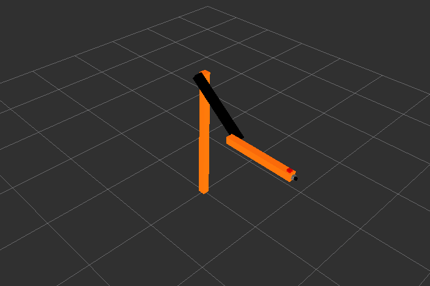

# MoveIt Simulator Controller

A simulation interface for a hardware interface for ros_control, and loads default joint values from SRDF

Intended to replace ``moveit_fake_controller_manager`` - this supports simulated trajectory following and loading an inital position

Developed by [Dave Coleman](http://dav.ee/) at the University of Colorado Boulder

Status:

 * [](https://travis-ci.org/davetcoleman/moveit_sim_controller) Travis CI
 * [](http://jenkins.ros.org/job/devel-indigo-moveit_sim_controller) Devel Job Status
 * [](http://jenkins.ros.org/job/ros-indigo-moveit-sim-controller_binarydeb_trusty_amd64/) AMD64 Debian Job Status



## Install

### Ubuntu Debian

```
sudo apt-get install ros-indigo-moveit-sim-controller
```

## Code API

See [Class Reference](http://docs.ros.org/indigo/api/moveit_sim_controller/html/)

## Usage

To set your robot's initial simulated position, create a *planning group* in your SRDF using the *MoveIt Setup Assistant* named something like ``whole_body`` or ``arm`` that contains all of your robot's joints. Then, create a *pose* for the planning group that is your start position, and name it something like ``home``.

Then load this node with the following ROS params (yaml is suggested use):

    # MoveIt-specific simulation settings:
    moveit_sim_hw_interface:
      joint_model_group: arm
      joint_model_group_pose: home

See [ros_control_boilerplate](https://github.com/davetcoleman/ros_control_boilerplate) for more detailed instructions about using ros_control to visualize your robot - this package simply inherits from that package and adds some MoveIt! dependencies that can parse SRDFs for your initial state.

## Contribute

Please send PRs for new helper functions, fixes, etc!
